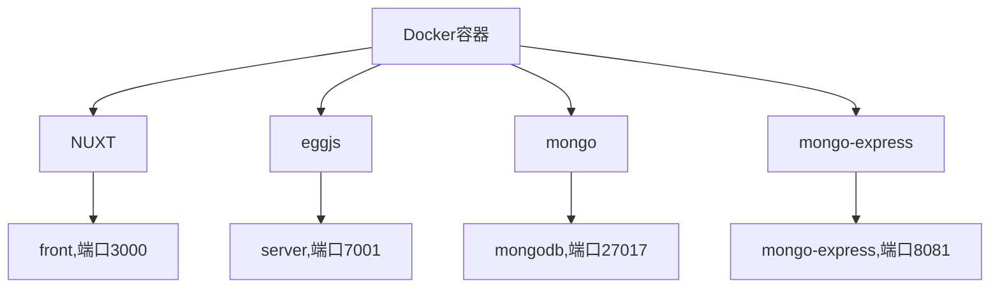

### 整体架构




```
容器内网络 network(172.2.0.0/24)
```

前端使用代理的方式访问后端,后端去访问`Mongodb`

#### 前端容器

##### 设置反向代理

`Nuxt.config.prod.js`

```json
proxy: {
      '/api/': {
        target: 'http://server:7001',
        secure: false,
        pathRewrite: {
          '^/api': ''
        }
      }
    }
```

##### `package.json`增加一句脚本

需要指定`--config`

```json
"start:docker": "cross-env NODE_ENV=production node --config-file nuxt.config.prod server/index.js"
```

##### 设置`dockerfile`

#### 后端容器

##### 配置`package.json`

```json
"start:docker": "egg-scripts start --title=egg-server-server",
```

##### 设置`dockerfile`

